# DevOps Git Version Control Task

## 📌 Objective

To manage a DevOps project using Git best practices — including branching, commits, pull requests, tags, and clean documentation.

---

## 🧰 Tools Used

- Git (Version Control)
- GitHub (Remote Repository)

---

## 🔀 Git Workflow Followed

1. Initialized repo with `master` branch.
2. Created `dev` and `feature` branches.
3. Made commits in `feature`, merged into `dev` via Pull Request.
4. Merged `dev` into `master`.
5. Added `.gitignore` to avoid unnecessary files.
6. Tagged the release with `v1.0`.

---

## 📸 Screenshots (Step-by-Step)

> These screenshots document each step of the Git workflow for complete clarity.

### 🔹 Repository Initialization

- ✅ **Empty repo on GitHub**  
  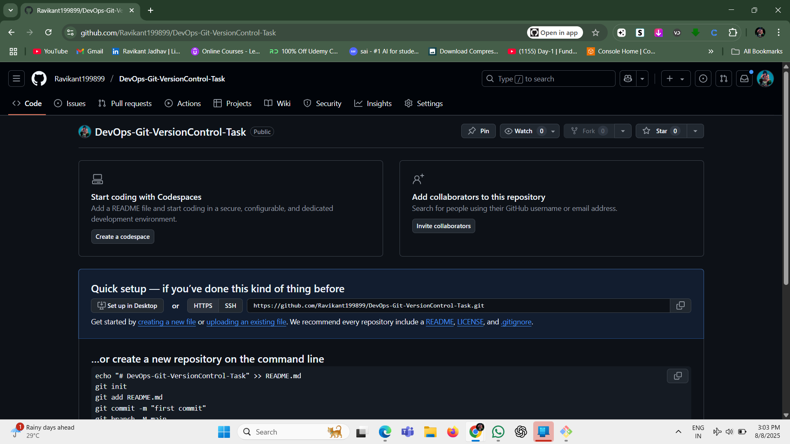

- ✅ **Local Git initialization**  
  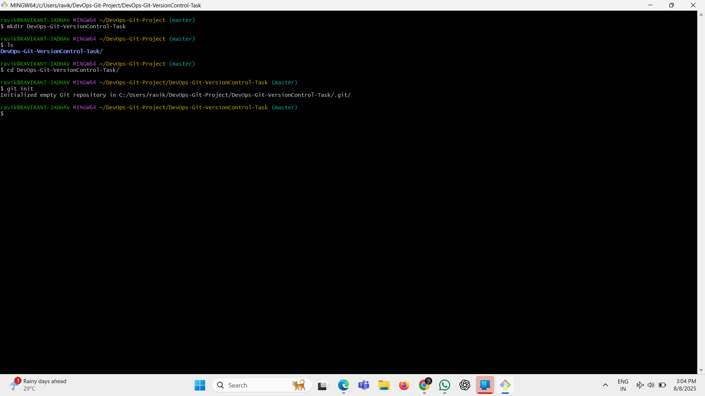

---

### 🔹 Branching

- ✅ **Branch creation and switching**  
  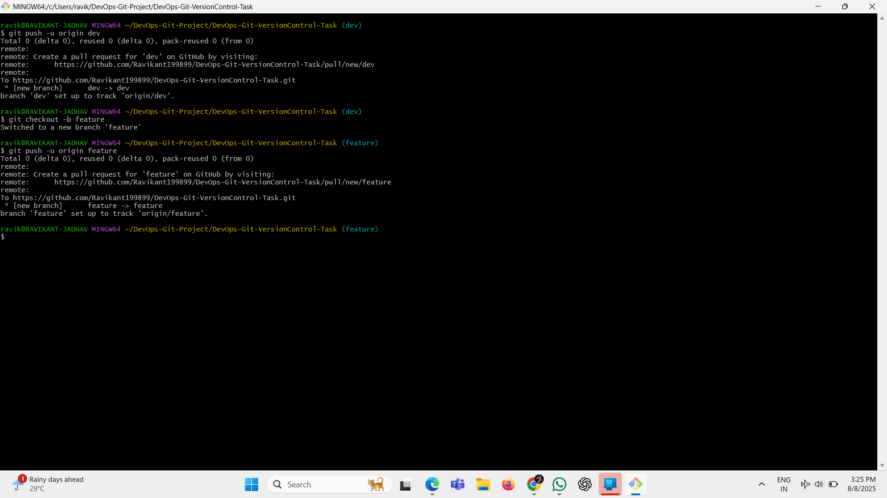

- ✅ **Branches listed on GitHub**  
  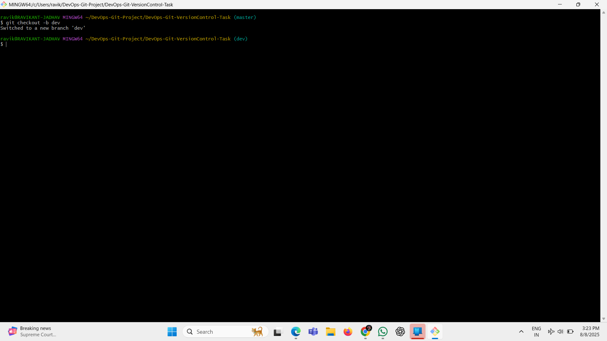

---

### 🔹 Committing & Pushing

- ✅ **Commit made and pushed**  
  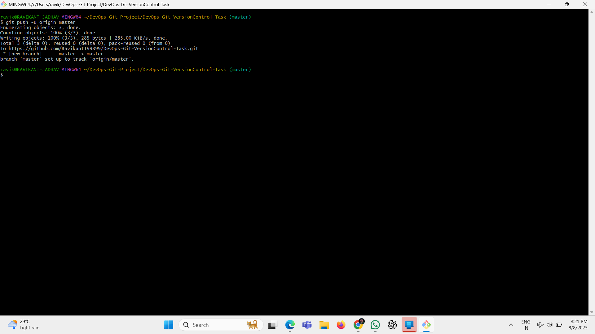

- ✅ **New commit shown in GitHub**  
  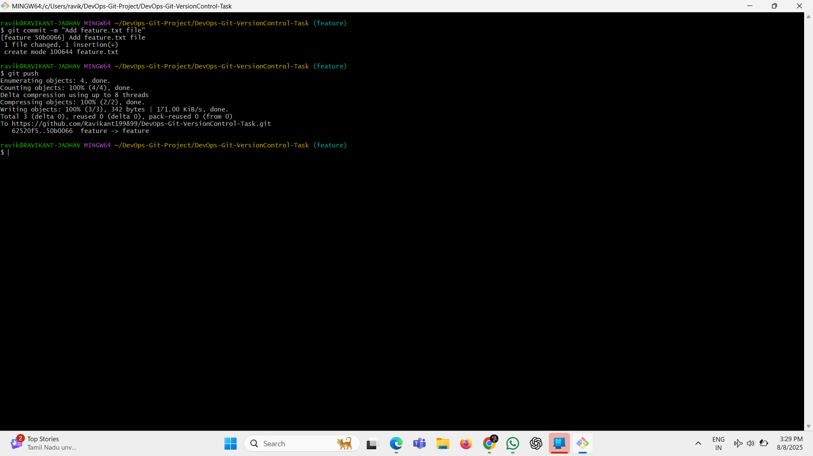

- ✅ **Feature.txt file in repo**  
  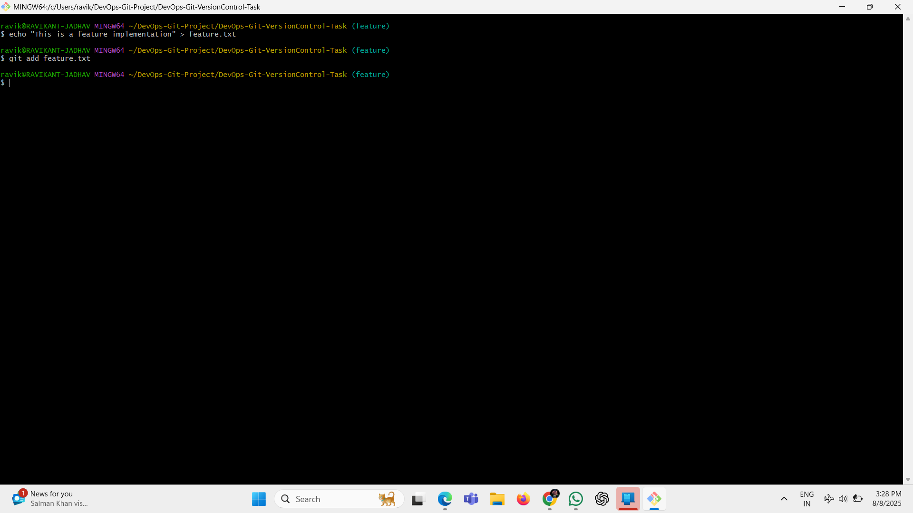

---

### 🔹 Pull Requests

- ✅ **Pull Request page (feature → dev)**  
  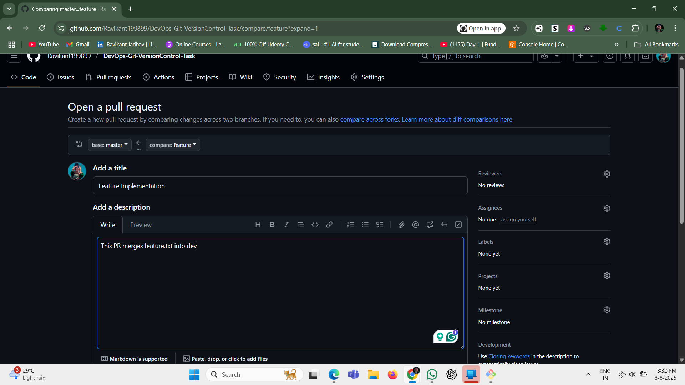

- ✅ **Pull Request merged (dev → master)**  
  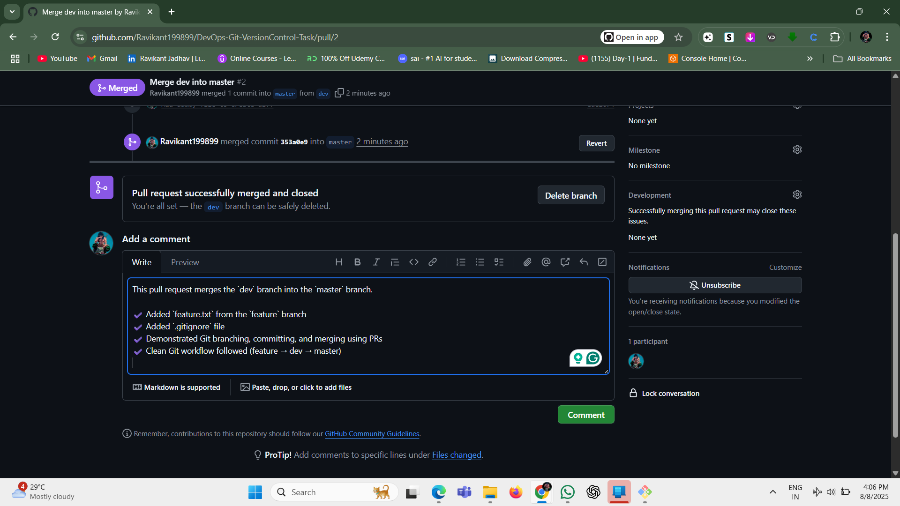

- ✅ **Merge confirmation**  
  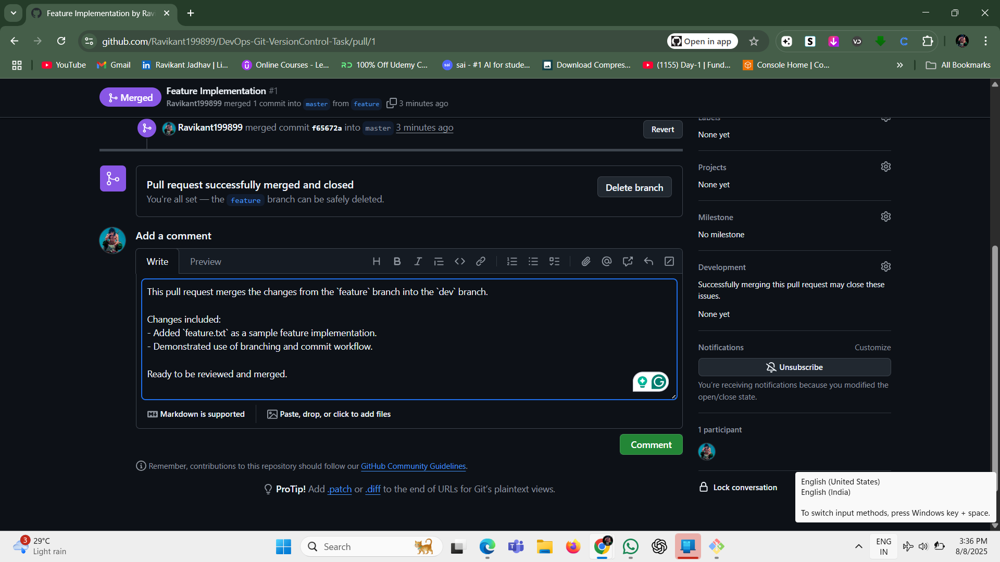

---

### 🔹 Other Features

- ✅ **.gitignore added**  
  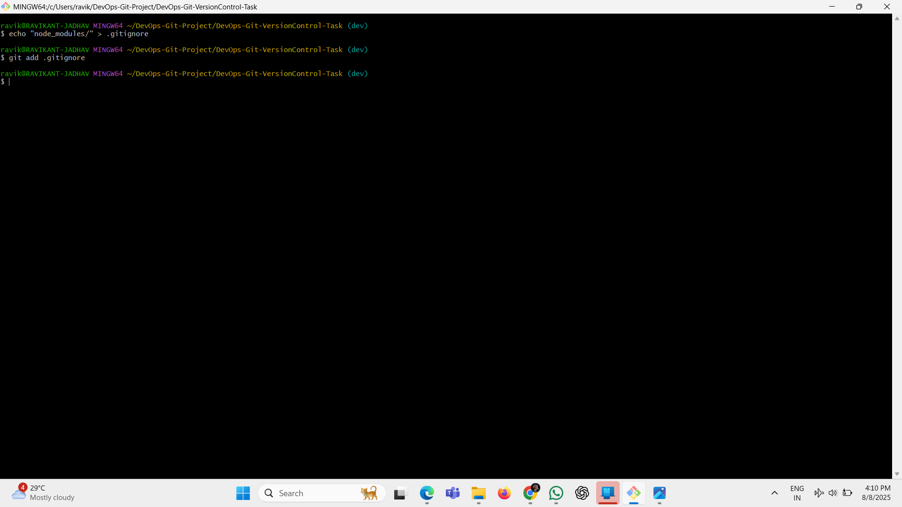

- ✅ **Master branch as default**  
  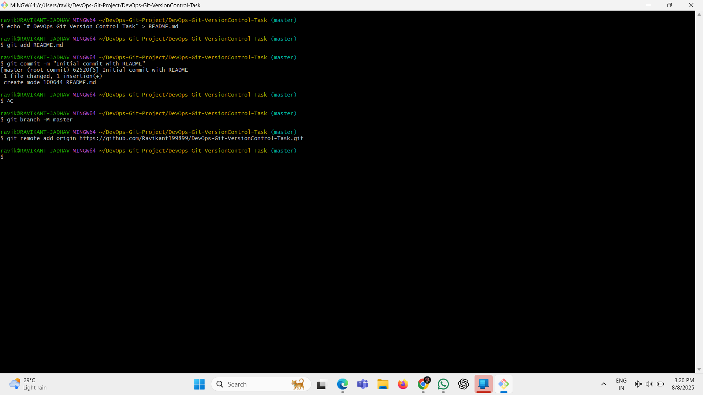

- ✅ **Tag v1.0 created and released**  
  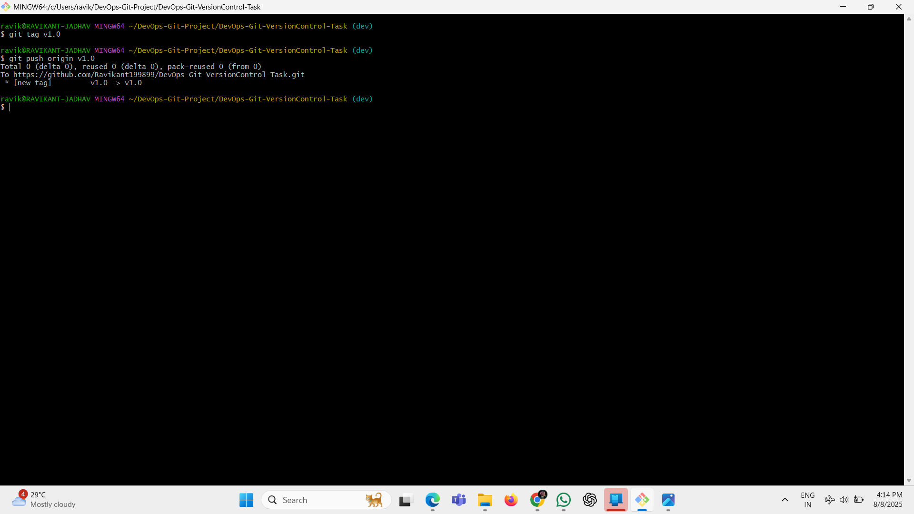

---

## 🧾 Conclusion

This task demonstrates a complete Git-based DevOps workflow including:

- Branching (`master`, `dev`, `feature`)
- Clean commit structure
- Pull Request collaboration
- Release tagging
- Using `.gitignore`
- Markdown documentation

This repository is designed for **beginners** and can be showcased in interviews or portfolios as a solid understanding of version control in DevOps projects.

---
